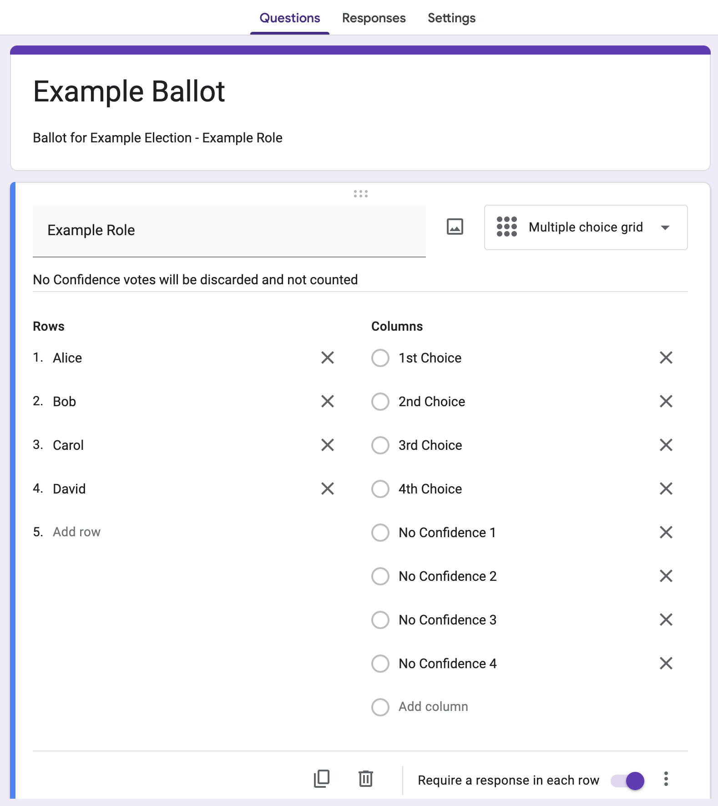
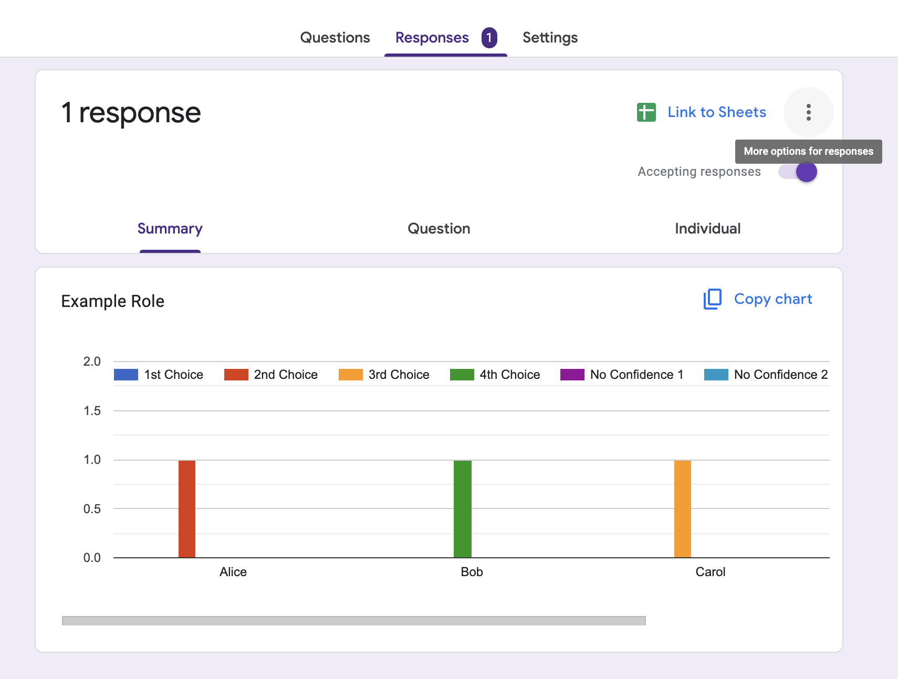

# Ranked Choice Vote (system)
*Developed by Isaac Song and Andy Yu for GTMUN*

# Info
## Ranked Choice Vote Info
Ranked Choice Vote is a voing method where voters rank the candidates instead of only casting 1 vote. This is prefered over First-Past-the-Post (FPP) voting systems for a variety of reasons, one of the main ones being that FPP voting systems encourages voting for the most "viable" candidate instead of the preferred candidate in fear of wasting votes. Our implementation is a version of Ranked Choice Voting System, the Instant-Runoff Voting System, where the votes for "least viable" candidate automatically and repeatedly gets redistributed to the rest of the candidates until there is a single candidate left. 

### "Least Viable" Candidate Methodology
We determine the "least viable" candidate (LVC) by the candidate with the least number of 1st choice votes. If there is a tie, then it selects the least number of 2nd choice votes among the tied, and this process continutes there is a candidate with the least number of 1st choice votes. In the situation where multiple candidates are tied all the way, it randomly selects a candidate as the LVC.

## Implemention Info
**Non-Early Termination**: While early termination is possible (stops once a candidate achieves more than 50% of the votes), we choose not to early terminate to develop a final ranking of all the candidates in case one candidate chooses to not take the position (in favor of another position they won for instance). 

**No Confidence**: We allow for no-confidence votes as we believe it is more fair for the voters. No confidence votes are not ordered and will not be accounted for in the any choice. It is effectively allowing the voter to not rank the candidate among their choices. There should be as much No Confidence choices as there are candidates.

**Detailed Logs**: We default to displaying in close detail each elimination round and its vote redistribution in order to better facilitate human-check of each of the vote processing. It also helps provide a better understanding of how RCV works. This could be turned off with the `-v` flag.


# Setup Steps
## Form Setup

 <br>

## Collect Votes
Standard Form distribution (link and/or QR code)

## Extract CSV



# Execution
### Dependencies
- pandas
- numpy
```
pip install requirements.txt
```

### Parameters
**filename** -- .csv filepath\
**choiceOrder** -- order of possible values, optional, default ["1st Choice", "2nd Choice", ..., "30th Choice"]\
**discardPrefix** -- prefix string to not rank candidate, optional, default "No Confidence"
**verbose** -- prints/displays step-by-step calculation and elimination information, optional, default True

### Jupyter Notebook
There is a Jupyter notebook implemention that makes it easier to scroll and keep track of multiple results. Additionally, it displays Panda dataframes prettier than the console.

### Python
Instead of a list for choice_order, the console takes in a comma-space separated string value (e.g. "1st Choice, 2nd Choice, 3rd Choice, 4th Choice")
```
python3 RCV.py {filepath} -c {choice_order} -d {discard_prefix}
```

---

# Sample
## Sample Input
[Example Results - ExampleRole.csv](Example%20Results%20-%20ExampleRole.csv)
|Timestamp          |ExampleRole [Alice]|ExampleRole [Bob]|ExampleRole [Carole]|ExampleRole [David]|
|-------------------|-------------------------|-------------------------|-------------------------|-------------------------|
|01/01/2000 00:00:49|2nd Choice               |4th Choice               |3rd Choice               |1st Choice               |
|01/01/2000 00:01:02|3rd Choice               |4th Choice               |2nd Choice               |1st Choice               |
|01/01/2000 00:01:03|2nd Choice               |1st Choice               |3rd Choice               |No Confidence 1          |
|01/01/2000 00:01:05|4th Choice               |1st Choice               |2nd Choice               |3rd Choice               |
|01/01/2000 00:01:08|1st Choice               |4th Choice               |3rd Choice               |2nd Choice               |
|01/01/2000 00:01:08|1st Choice               |4th Choice               |3rd Choice               |2nd Choice               |
|01/01/2000 00:01:09|3rd Choice               |No Confidence 1          |1st Choice               |2nd Choice               |
|01/01/2000 00:01:09|3rd Choice               |4th Choice               |2nd Choice               |1st Choice               |
|01/01/2000 00:01:11|1st Choice               |4th Choice               |3rd Choice               |2nd Choice               |
|01/01/2000 00:01:13|2nd Choice               |No Confidence 1          |3rd Choice               |1st Choice               |
|01/01/2000 00:01:16|1st Choice               |4th Choice               |2nd Choice               |3rd Choice               |
|01/01/2000 00:01:20|1st Choice               |4th Choice               |3rd Choice               |2nd Choice               |
|01/01/2000 00:01:20|1st Choice               |2nd Choice               |4th Choice               |3rd Choice               |
|01/01/2000 00:01:24|1st Choice               |3rd Choice               |2nd Choice               |4th Choice               |
|01/01/2000 00:01:25|No Confidence 1          |3rd Choice               |2nd Choice               |1st Choice               |
|01/01/2000 00:01:28|3rd Choice               |No Confidence 1          |1st Choice               |2nd Choice               |
|01/01/2000 00:01:32|2nd Choice               |4th Choice               |1st Choice               |3rd Choice               |
|01/01/2000 00:01:36|1st Choice               |4th Choice               |3rd Choice               |2nd Choice               |
|01/01/2000 00:01:37|2nd Choice               |No Confidence 1          |3rd Choice               |1st Choice               |
|01/01/2000 00:01:40|3rd Choice               |4th Choice               |2nd Choice               |1st Choice               |
|01/01/2000 00:01:42|1st Choice               |4th Choice               |3rd Choice               |2nd Choice               |
|01/01/2000 00:01:43|2nd Choice               |No Confidence 1          |3rd Choice               |1st Choice               |
|01/01/2000 00:01:50|1st Choice               |No Confidence 1          |3rd Choice               |2nd Choice               |
|01/01/2000 00:01:52|4th Choice               |1st Choice               |2nd Choice               |3rd Choice               |
|01/01/2000 00:01:57|1st Choice               |No Confidence 1          |3rd Choice               |2nd Choice               |
|01/01/2000 20:00:11|2nd Choice               |4th Choice               |3rd Choice               |1st Choice               |

## Sample Output
```
=============================== Round 0 ===============================

       Alice  Bob  Carole  David
voter                           
0          2    4       3      1
1          3    4       2      1
2          2    1       3     -1
3          4    1       2      3
4          1    4       3      2
5          1    4       3      2
6          3   -1       1      2
7          3    4       2      1
8          1    4       3      2
9          2   -1       3      1
10         1    4       2      3
11         1    4       3      2
12         1    2       4      3
13         1    3       2      4
14        -1    3       2      1
15         3   -1       1      2
16         2    4       1      3
17         1    4       3      2
18         2   -1       3      1
19         3    4       2      1
20         1    4       3      2
21         2   -1       3      1
22         1   -1       3      2
23         4    1       2      3
24         1   -1       3      2
25         2    4       3      1

Top Vote Counts:
Alice     11
Bob        3
Carole     3
David      9
dtype: int64

Least Viable Choice(s) 1: 3 votes - ['Bob', 'Carole']
Least Viable Choice(s) 2: 1 votes - ['Bob']
Eliminating: Bob

Redistributing Votes: 
       Alice  Bob  Carole  David
voter                           
2          2    1       3     -1
3          4    1       2      3
23         4    1       2      3

Top Choice Movement (+):
Alice     1
Carole    2
David     0
dtype: int64


=============================== Round 1 ===============================

       Alice  Carole  David
voter                      
0          2       3      1
1          3       2      1
2          1       2     -1
3          3       1      2
4          1       3      2
5          1       3      2
6          3       1      2
7          3       2      1
8          1       3      2
9          2       3      1
10         1       2      3
11         1       3      2
12         1       4      3
13         1       2      4
14        -1       2      1
15         3       1      2
16         2       1      3
17         1       3      2
18         2       3      1
19         3       2      1
20         1       3      2
21         2       3      1
22         1       3      2
23         3       1      2
24         1       3      2
25         2       3      1

Top Vote Counts:
Alice     12
Carole     5
David      9
dtype: int64

Least Viable Choice(s) 1: 5 votes - ['Carole']
Eliminating: Carole

Redistributing Votes: 
       Alice  Carole  David
voter                      
3          3       1      2
6          3       1      2
15         3       1      2
16         2       1      3
23         3       1      2

Top Choice Movement (+):
Alice    1
David    4
dtype: int64


=============================== Round 2 ===============================

       Alice  David
voter              
0          2      1
1          3      1
2          1     -1
3          2      1
4          1      2
5          1      2
6          2      1
7          3      1
8          1      2
9          2      1
10         1      3
11         1      2
12         1      3
13         1      4
14        -1      1
15         2      1
16         1      2
17         1      2
18         2      1
19         3      1
20         1      2
21         2      1
22         1      2
23         2      1
24         1      2
25         2      1

Top Vote Counts:
Alice    13
David    13
dtype: int64

Least Viable Choice(s) 1: 13 votes - ['Alice', 'David']
Least Viable Choice(s) 2: 9 votes - ['Alice', 'David']
Random Least Viable Choice: David
Eliminating: David

Redistributing Votes: 
       Alice  David
voter              
0          2      1
1          3      1
3          2      1
6          2      1
7          3      1
9          2      1
14        -1      1
15         2      1
18         2      1
19         3      1
21         2      1
23         2      1
25         2      1

Top Choice Movement (+):
Alice    9
dtype: int64


=============================== Round 3 ===============================

       Alice
voter       
0          1
1          2
2          1
3          1
4          1
5          1
6          1
7          2
8          1
9          1
10         1
11         1
12         1
13         1
14        -1
15         1
16         1
17         1
18         1
19         2
20         1
21         1
22         1
23         1
24         1
25         1

Top Vote Counts:
Alice    22
dtype: int64

Winner: Alice

===

Final Ranks:
1. Alice
2. David
3. Carole
4. Bob
```